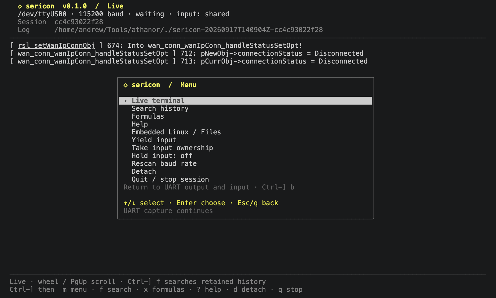
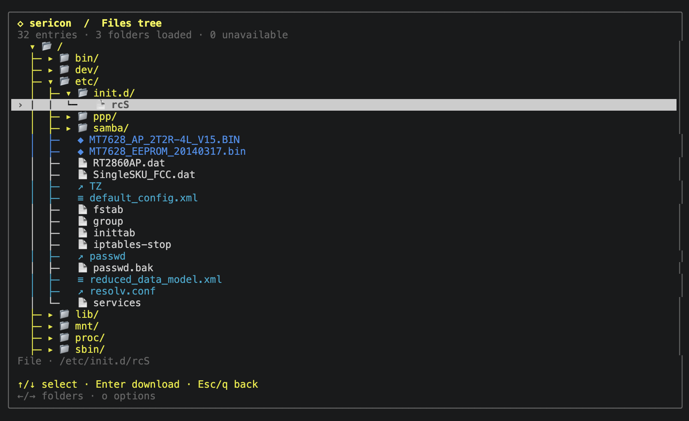

# Sericon

Sericon is a better serial terminal for Linux, built to remove some of the annoyances I had with other serial terminals. With Sericon, you can connect with one command and no flags, use arrow-key menus and searchable scrollback without a dedicated copy mode, work with an embedded Linux filesystem over serial, and automate repeated tasks with **formulas**.

```sh
sericon
```

With no arguments, Sericon looks for an attached UART adapter, starts at 115200 baud, and checks incoming text to identify the rate. Received and transmitted bytes are logged in the current directory by default.

**0.1.0 beta · Linux, including Raspberry Pi**

[Get started](docs/getting-started.md) · [Install](docs/installation.md) · [Documentation](https://sericon.xyz/) · [Beta scope](docs/beta.md) · [MIT license](LICENSE)

[](docs/assets/screenshots/main-menu.png)

## Why Sericon

- Start without looking up a device path or typing a baud rate. Adapter preferences and passive baud detection handle connection setup, with flags available for explicit settings.
- Easy-to-use arrow-key menus with no need to memorize shortcuts.
- Scroll through output without a separate copy mode.
- Built-in search using literal strings or regex.
- Get files off an embedded Linux device through its serial shell. The optional helper adds a file tree, verified uploads and device inspection, all over the same serial connection.
- Turn repeated serial work into formulas: scan logs for endpoints or possible passwords, send commands, or wait for a boot prompt. Rhai runs inside Sericon, so formulas need no separate scripting runtime.
- Keep a record of both sides of the conversation. Logging starts by default and capture continues when the terminal detaches.
- Let scripts or an AI coding tool join the running session while the human terminal stays attached. The CLI and MCP share its history and coordinate input.

Sericon runs independently of Athanor (which is coming soon). No AI provider, model key, Python runtime or network connection is required for the terminal. AI access is optional.

## Install and start

Download the [0.1.0 beta](https://github.com/digitalandrew/sericon/releases/tag/v0.1.0) for your Linux host:

| Host | Download |
| --- | --- |
| Intel / AMD 64-bit | [x86-64](https://github.com/digitalandrew/sericon/releases/download/v0.1.0/sericon-0.1.0-linux-x86_64.tar.gz) |
| ARM64 / 64-bit Raspberry Pi OS | [ARM64](https://github.com/digitalandrew/sericon/releases/download/v0.1.0/sericon-0.1.0-linux-aarch64.tar.gz) |
| ARMv6+ hard-float / 32-bit Raspberry Pi OS, including original Pi and Zero | [ARMv6 hard-float](https://github.com/digitalandrew/sericon/releases/download/v0.1.0/sericon-0.1.0-linux-armv6hf.tar.gz) |

All three are static executables with all four optional DUT helpers embedded. See [installation](docs/installation.md#download-a-prebuilt-release) for checksum verification and architecture selection. After extracting the archive, run these commands from its directory:

```sh
install -Dm755 sericon "$HOME/.local/bin/sericon"
sericon
```

Put `~/.local/bin` on `PATH` and give the current user access to the serial device. [Building from source](docs/installation.md#build-the-terminal) is also supported.

Common overrides:

```sh
sericon --port /dev/ttyUSB0 --baud 115200
sericon --log-dir ./captures
sericon --no-log
```

Automatic baud detection needs enough readable traffic. Silence leaves the initial rate unconfirmed. Sericon sends no probe characters and does not reset the device. See [configuration](docs/configuration.md) for adapter preferences, baud candidates and logging defaults.

## Find the controls

Press **Ctrl-]**, release, then **m** to open the menu. Arrows select, Enter chooses, and Esc/q goes back. Every option menu uses these controls.

| Task | Control |
| --- | --- |
| Scroll earlier output | Mouse wheel or Page Up / Page Down |
| Search history | Ctrl-] f |
| Run a formula | Ctrl-] x |
| Embedded Linux / Files | Ctrl-] l |
| Return to live output | Ctrl-] b |
| Help | Ctrl-] ? |
| Detach; keep capture running | Ctrl-] d |
| Stop; flush logs and close UART | Ctrl-] q |

**Ctrl-C goes to the device.** To reconnect after detaching, run `sericon attach`. Use `sericon sessions` and an explicit session ID when several are running.

## Embedded Linux over serial

At an empty, logged-in Linux shell prompt, open **Embedded Linux / Files → Connect and browse**. Download files using the DUT's existing shell tools, or install the optional static C helper from **Set up helper**.

The helper adds an expandable file tree, verified uploads, device inspection and saved overview collections. Bundled payloads cover x86_64, mipsel, aarch64 and arm [ARMv6KZ hard-float/VFPv2]. Select the DUT architecture independently of the host running Sericon.

[](docs/assets/screenshots/file-tree.png)

See [Files](docs/files.md) for requirements and transfer limits, or [helper setup](docs/helper.md) for the illustrated installation steps.

## Share with an AI coding tool

Register the local bridge with the client in use:

```sh
codex mcp add sericon -- "$HOME/.local/bin/sericon" mcp
claude mcp add --transport stdio --scope user sericon -- "$HOME/.local/bin/sericon" mcp
```

Start `sericon` in a terminal, then ask the client to list Sericon sessions and read the desired session. Both clients can see the traffic; writer reservations coordinate input. An agent can also create and run formulas for repeated or time-sensitive UART work.

[AI tools and MCP](docs/ai-tools.md) covers session discovery, context, input ownership and the available tools. [Formulas](docs/formulas.md) covers built-in scans and custom scripts.

## Documentation and beta feedback

Read the documentation at [sericon.xyz](https://sericon.xyz/). The same guides are available in this checkout through the [documentation index](docs/index.md).

Report problems in [GitHub Issues](https://github.com/digitalandrew/sericon/issues). The beta targets Linux. Baud detection is a text heuristic; file transfers require a ready Linux shell; automatic reconnect is not included. [Beta scope and validation](docs/beta.md) distinguishes software fixtures, CPU emulation and physical hardware coverage, and lists the details to include in an issue report.

For source checks, documentation preview and release preparation, see [development](docs/development.md).

## License

Sericon is licensed under the [MIT license](LICENSE). See [third-party components](docs/third-party.md) for dependency notices.
