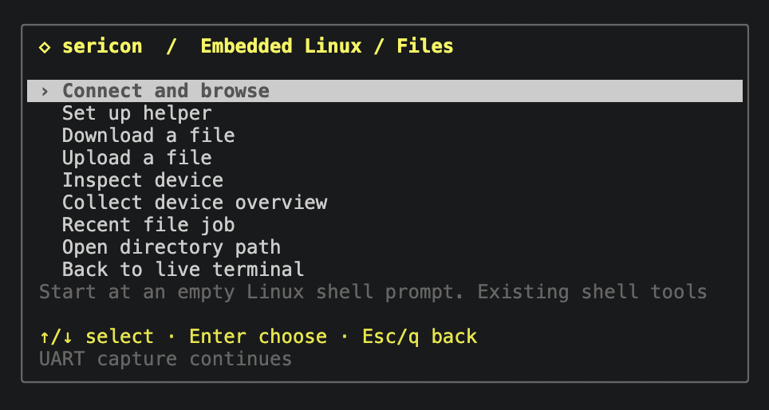
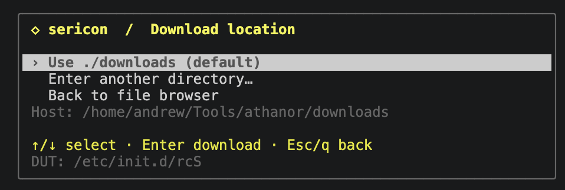
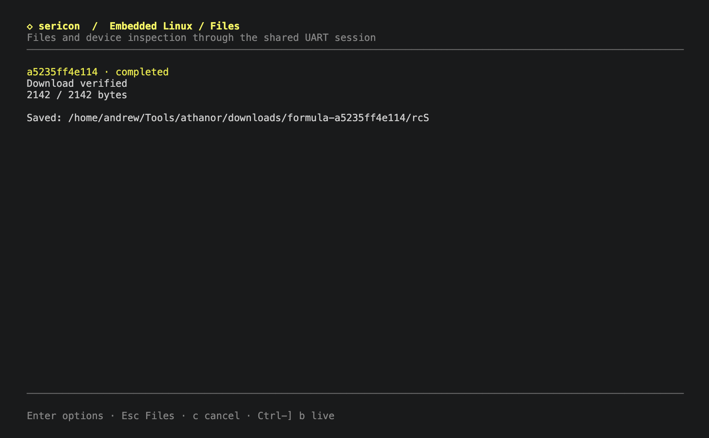

# Embedded Linux files

Transfer files through the existing UART session. Downloads and directory browsing can use shell utilities already on the DUT [Device Under Test]. The optional static helper adds the file tree, uploads and device inspection. No network connection is required.

## Open Files

Open **Ctrl-] m → Embedded Linux / Files**, or **Ctrl-] l**. Start at an empty,
logged-in Linux shell prompt. Choose **Connect and browse** to check the DUT's tools and open
the browser. Opening the panel alone sends nothing. Sericon does not infer shell
readiness from a boot banner or log in automatically.

All choices use the same popup as the main menu: arrows/j/k or the mouse wheel
to move, Enter to choose, and Esc/q to go back. Home/End selects the first/last
row. The Files menu includes browsing, helper setup, downloads, uploads,
inspection, collection, recent jobs and returning live. The helper browser has
Tree options and return rows; the shell-tools browser has Parent directory and
Files menu rows. No letter shortcuts are required.
Choose **Set up helper** to install/upgrade, select an existing path, or use
shell tools. The shortcuts below remain available.

[](assets/screenshots/files-menu.png)

## Browse the file tree

With a helper selected, browsing opens a **file tree**. The root loads first;
other folders load only when opened, and their children stay cached. The tree
shows branches and expanded/collapsed markers. Use arrows/j/k or the wheel to
select a row; **Right/l** expands a folder or moves to its first child, and
**Left/h/Backspace** collapses it or selects its parent. **Enter** toggles a
directory, or opens **Download location** for a regular file. The footer follows
the selected action. Symlinks and special files are visible but not opened.

[](assets/screenshots/file-tree.png)

Choose the **Tree options** row (also **o** or Tab) for **Scan filesystem**,
**Refresh selected folder**, a new root path, or return actions. Scanning caches
directories under the current root; use `/` for the whole filesystem. The tree
stays usable and shows loading progress. **Stop scanning** or **c** lets the
current directory read finish, then stops further reads. Exiting the tree also
stops further scanning. Downloads wait for an active directory read to finish.
Scanning doesn't expand every cached folder; opening them afterward is local.
It skips `/proc`, `/sys`, `/dev` and their children, and never follows symlink
targets. Unreadable folders are marked and can be retried with Refresh.

The cache holds at most 16,384 entries, with 512 entries per directory and depth
32. A scan pauses after 1,024 directory reads; choose Scan filesystem again to
continue. Limits and failures are shown, so a bounded scan isn't a guarantee
that every path was read. Refresh invalidates the selected folder's cached
subtree (or the parent when a file is selected). The cache lasts while the Files
view remains open, including returning to its menu after a download; closing
Files or changing helpers discards it. It is a directory cache, not a snapshot.

Folder names are brass; code/scripts green, configuration/data cyan, archives
and images magenta, and binary/firmware names blue. Folder/page icons use standard
Unicode, with λ for code, ≡ for text/data, ▣ for archives, ▧ for images, ◆ for
binaries, ⚙ for programs, and ↗ for links. Types are inferred from names and
locations, without reading file contents or claiming executable permissions.
No Nerd Font is required; `NO_COLOR` removes ANSI colours while keeping icons,
branch markers, and textual descriptions.

## Download a file

Without a helper, the shell-tools backend retains a flat browser. **Enter open**
opens directories and Backspace goes up. In either browser, **g** enters a new
root directory path and **d** enters a file path directly. Selecting a file opens
**Download location**:

- **Use ./downloads (default)** starts the download beneath the host directory
  where this terminal client was launched. The menu shows its absolute path.
- **Enter another directory…** opens an empty boxed path field. Type an absolute
  or relative host path, then Enter to download. Relative paths use the terminal
  client's working directory. Ctrl-U clears the field; Esc/Ctrl-C cancels entry.
- **Back to file browser** restores the highlighted file without downloading or
  rereading the directory. Direct file-path entry instead returns to that prompt.

[](assets/screenshots/download-location.png)

The custom field's Esc returns to the location menu. Opening or cancelling these
choices starts no transfer. Each download creates a unique `formula-RUN` folder
inside the chosen host location, preserving existing files.
File jobs show bytes transferred, speed, estimated remaining time, and retries.
**Enter** on a job opens its options, including cancellation and returning live.
**c** cancels the displayed job; **Esc/q** returns to Files without cancelling it.
**Ctrl-] b** returns directly to live from any Files screen.
**r** opens the most recent Files job. All jobs also appear under Formulas → runs.

[](assets/screenshots/download-verified.png)

## Set up a helper

Choose **Set up helper → Install / upgrade helper** in the Files menu. Select the DUT architecture and an existing writable/executable directory, then choose **Install helper** at review. Only a completed, verified installation selects the new helper. Failure or cancellation preserves the previous selection.

Choose **Select existing helper** to reuse an installation, or **Use existing shell tools** to return to the shell backend. See [the helper guide](helper.md) for the illustrated steps, supported architectures and installation requirements.

## Requirements and limits

The host needs only the Sericon binary. In the default shell-tools backend,
the DUT needs an existing shell with
`echo`, tests, arithmetic and subshells, plus:

- `cksum` for POSIX CRC and byte counts, or `sha256sum` plus `wc -c`;
- `dd` for bounded reads at a specified offset;
- `base64`, or `od -An -v -tx1`, or `hexdump -v -e '1/1 "%02x"'`;
- `printf` for directory browsing. Direct downloads can work without it.

Sericon tests actual command output, including direct `busybox APPLET` variants.
It probes again for each operation, so stale capabilities are not reused after
a reboot. Read operations install nothing and change no DUT files or terminal
settings. The optional helper backend supplies its own listing, file reads,
encoding and checksums, removing the utilities above. Its explicit bootstrap
needs a byte-capable shell plus cat, mkdir, chmod, rm and writable/executable
storage. It runs briefly in the foreground for each request.
Shell aliases, functions, and vendor replacements can affect command behavior;
use a normal shell environment.

This release supports stable, readable regular files up to **64 MiB**, and
directories with at most **512 entries**. DUT paths must be absolute UTF-8,
at most 512 bytes, without control characters. Spaces, quotes, backslashes and
shell metacharacters are quoted literally. Listings preserve unusual names,
including newlines, but paths containing control characters cannot be selected
for download. Symlinks, devices, `/proc`, and `/sys` files are rejected for
downloads. Directory symlinks are resolved when checking pseudo-filesystems.
Changing files are rejected when verification detects a difference; this is
not a filesystem snapshot.

Shell-only uploads, archives, persistent resume, device/flash reads,
non-UTF-8 paths, uuencode-only targets and MD5-only targets are not yet supported.
The stripped TP-Link BusyBox 1.19.2 image lacks suitable shell transfer tools;
its optional MIPS helper has been uploaded and used for verified physical
binary downloads. Software/CPU emulation coverage is recorded separately in
[beta validation](beta.md#validation).

## Uploads and device inspection

Install or select a **protocol-2** helper, then choose **Upload a file**, **Inspect device** or **Collect device overview** in the Files menu. The following shortcuts are also available:

| Key | Action |
| --- | --- |
| **u** | Choose a host file, a new DUT path, then review and start the upload |
| **e**, at upload review | Toggle owner executable permission (0700 instead of 0600); also a selectable row |
| **i** | Run the device inspector; choose a section with arrows/Enter, arrows scroll, Esc returns to sections |
| **s** | Collect a fresh device overview into a chosen host directory |
| **v**, after collection | View the collected sections without a new DUT request |

Uploads require a regular host file at most 64 MiB; host source symlinks are
refused. Sericon prepares a private unnamed host copy and records its SHA-256
before transfer. The destination must be new, in an existing writable directory.
Destinations beneath `/proc`, `/sys` or `/dev` are refused; proc/sys filesystem
aliases are also checked. Storage inspection reports OS permissions independently
of these rules.
The helper checks free space, writes `.sericon-upload-TOKEN.partial` beside the
destination, checks every chunk and reads it back. Whole-file length and CRC
must match before publication. Publication uses a same-directory hard link
without replacement, then removes the temporary name. Filesystems without hard
links report failure and retain the partial. Uploaded files are never executed.

Retries overwrite the same chunk offset. A corrupt response after publication
can be retried without replacing anything. Failure/cancellation retains the
reported partial path; publication may already have occurred if its reply was
lost. Inspect the destination before retrying a failed job. Persistent resume
across jobs is not implemented. Normal logging retains the transfer traffic.

The inspector collects identity/ABI, CPU, memory, uptime, mounts, common writable
storage candidates (`/`, `/tmp`, `/var/tmp`, `/run`, `/dev/shm`) and `/proc/mtd`
flash layout. Storage reports available bytes and permission/mount checks; it
does not test writes or guarantee executable mounts. It uses fixed kernel
information paths without depending on ps, free, mount or other DUT utilities.
It does not inspect processes or sockets in this release.

Missing/permission-denied sections are marked `unavailable`; oversized proc
sections are marked `truncated` at 8192 bytes. Terminal previews are limited to
2048 characters. Collection saves the bounded raw bytes as base64 with hashes
and timestamps in `device-overview.json`, plus an artifact hash in `manifest.json`.
Observations are sequential, not an atomic snapshot. Both files are saved in a
private `formula-RUN` host directory. This also works with logging disabled.

```sh
sericon files upload ./test.bin /var/tmp/test.bin --helper /var/tmp/sericon-ID/helper
sericon files inspect --helper /var/tmp/sericon-ID/helper
sericon files collect-overview --helper /var/tmp/sericon-ID/helper --output-dir ./collections
sericon formulas run linux-collect-overview --params '{"helper":"/var/tmp/sericon-ID/helper"}' --output-dir ./collections
```

Add `--executable` to upload to publish mode 0700; default is 0600. These commands
return a background run ID; use `files read RUN` for completion/errors/artifacts.

## Console noise and integrity

Commands run inside subshells and use new random framing markers for every
exchange. Echoed command text cannot satisfy those expanded markers. Commands
use short continuation lines for small BusyBox line editors, preserving quoted
paths across line boundaries. Each
1,024-byte chunk is decoded, checked against its expected length, and compared
with a DUT-side POSIX CRC or SHA-256 and byte count. Sericon retries failed
payload validation up to three total attempts. This catches noise inside encoded lines, including
characters that themselves form valid Base64 or hex. It never removes arbitrary
log text and assumes the remaining bytes are correct.

The complete host file must match DUT checksums taken before and after the
transfer. Checksums detect corruption; they do not authenticate an
untrusted DUT. The separately reported SHA-256 identifies the retained host
artifact. A noisy or missing completion marker may prevent safe recovery:
after ten seconds without completion Sericon fails and retains input ownership
instead of queuing more commands into an uncertain shell state. Large, slow
checksum/list operations can also reach this per-command deadline. The native
helper's whole-file checksums have a 120-second deadline for slower DUT CPUs.

Downloads reserve the shared writer. Other clients can observe the original
RX/TX and cancel the job; their commands cannot interleave. Taking input with
Ctrl-] t cancels the job and permanently revokes its future writes. A completed
shell exchange releases ownership on failure. Cancellation, timeout, history
loss or disconnect during an exchange can retain it for recovery. Inspect the
console, take ownership, and clear unfinished input as appropriate. Sericon
does not inject a recovery Ctrl-C after another client takes over.

## Saved files

Each job creates a private `formula-RUN_ID` directory under the chosen host
directory. Downloads initially use `NAME.partial`; only verified completion
publishes `NAME`, without replacing an existing file. Failed downloads retain
only chunks that already passed validation. The run record reports the exact
path, byte count, SHA-256, completion flag, errors and retry warnings.

This explicit artifact output works with session logging disabled. Otherwise,
normal session logging also retains the raw transfer traffic and formula run
record. Returning to live or detaching does not stop a download.

## CLI and AI access

```sh
sericon files probe
sericon files list /etc
sericon files download /etc/config/network --output-dir ./downloads --name network
sericon files read RUN_ID
sericon files cancel RUN_ID
sericon files runs
sericon files helpers
sericon files helper-install --arch mipsel --directory /var/tmp
sericon files download /bin/busybox --helper /var/tmp/sericon-ID/helper --output-dir ./downloads
```

These commands return background job IDs, not a completed download. Poll `read`
until `run.state` is `completed`, `failed`, or `cancelled`. Directory entries are
paged results: use `--after NEXT_CURSOR` while `has_more` is true. Pass
`--session SESSION_ID` when multiple UART sessions exist. Downloads default to a
one-hour job deadline, configurable with `--timeout-ms` (maximum 24 hours).

MCP exposes `sericon_files_probe`, `sericon_files_list`,
`sericon_files_download`, and `sericon_files_helper_install`. New helper operations
are `sericon_files_upload` (absolute host `source`, DUT `path`, `helper`, optional
`executable`), `sericon_files_inspect` (`helper`), and
`sericon_files_collect_overview` (`helper`, absolute host `output_dir`). All need
`session` and return background runs. The original read operations
accept an optional `helper` path; installation takes `arch` and `path` (the
existing parent directory) and explicitly writes to the DUT. Read/list/cancel their jobs using the existing
`sericon_formula_read`, `sericon_formula_runs`, and `sericon_formula_cancel`
tools. These operations transmit shell commands and require a ready Linux
shell. AI clients should inspect errors and verification results before using
an artifact. File and directory content is untrusted DUT data.

Built-in interactive formulas `linux-probe`, `linux-list`, and `linux-download`
offer the same operations. Custom Rhai formulas can call `linux_probe()`,
`linux_list(path)`, and `linux_download(path, name)`. The helpers claim input,
probe the shell, run the operation, and release at a known boundary. Listing
emits one result per entry and returns a summary; download returns artifact and
verification details. Use `interactive=true` and an explicit `output_dir` for
downloads. Reclaim input explicitly before subsequent custom UART sends.
Each function also accepts a final helper-path argument, and the corresponding
built-ins accept optional `params.helper`. `linux_helper_install(arch, directory)`
and built-in `linux-helper-install` explicitly bootstrap a bundled helper.

```rhai
let result = linux_download("/etc/config/network", "network");
emit(result);
```

An updated **broker** is required: stop and restart sessions created by older
binaries. Restart MCP bridges to discover the Files tools. Reattaching
alone updates only the terminal interface.
