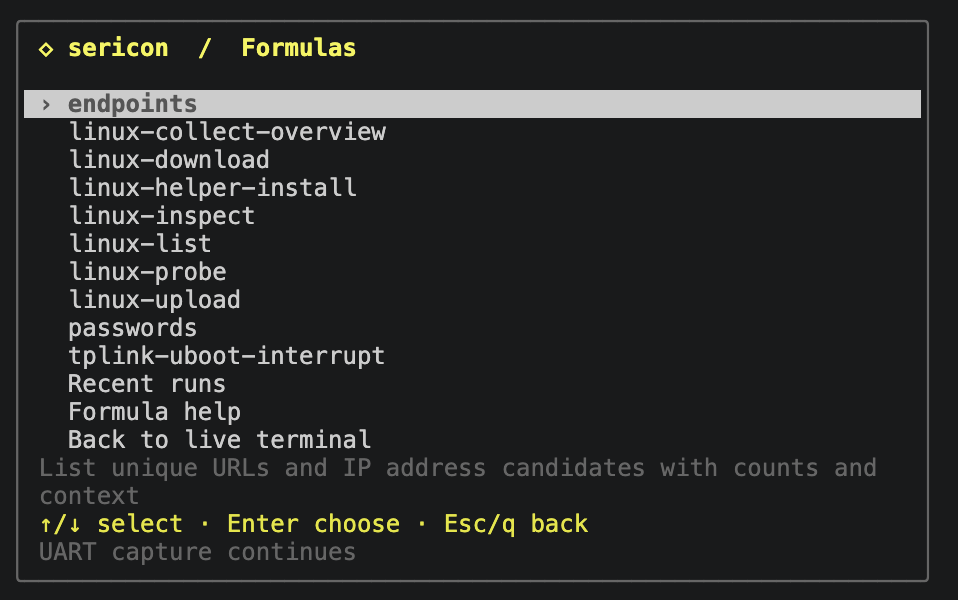
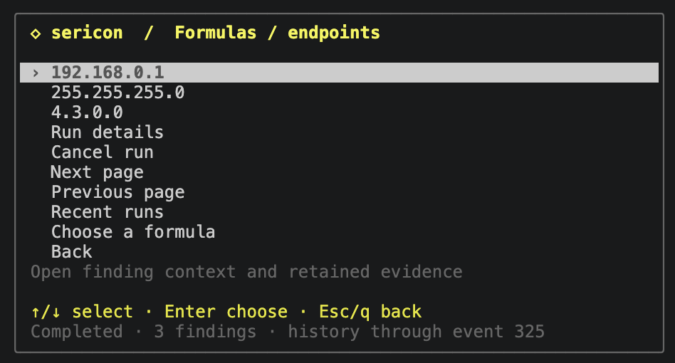

# Formulas

Formulas are Rhai scripts that analyze retained session history or interact with the UART. The interpreter, regex engine and built-in formulas are embedded in Sericon. Custom scripts run without installing Python or another interpreter.

## Run a formula

Open **Ctrl-] m → Formulas**, or **Ctrl-] x**. Select a formula, edit any parameters, timeout or output directory, then choose **Run formula**. Runs continue while the terminal returns to live output or detaches.

[](assets/screenshots/formulas.png)

The screenshot includes `tplink-uboot-interrupt`, a custom example registered on the pictured host. It is not a built-in formula.

```sh
sericon formulas list
sericon formulas run endpoints
sericon formulas runs
sericon formulas read RUN_ID
```

Pass `--session SESSION_ID` when more than one session is running. `run` returns a job ID immediately. Poll `read` for completion, progress and errors; page results with `--after NEXT_CURSOR` while `has_more` is true. Cancel with `sericon formulas cancel RUN_ID`.

## Built-in formulas

| Built-in | Results |
| --- | --- |
| `passwords` | Possible password, passwd, pwd, passphrase, PSK, and Wi-Fi key assignments, with context. Empty prompts and common redaction markers are excluded. |
| `endpoints` | URLs with ports/paths preserved and syntactically valid IPv4/IPv6 candidates. IP-like version numbers can still be candidates; inspect the context. |
| `linux-probe` | Check the ready Linux shell's existing transfer utilities. Interactive. |
| `linux-list` | Browse a DUT directory with the `path` parameter. Interactive. |
| `linux-download` | Verified DUT download with `path`, `name`, and explicit `output_dir`. Interactive. |
| `linux-helper-install` | Upload and verify a bundled static helper using `arch` and an existing writable DUT directory in `path`. Interactive; writes DUT files explicitly. |
| `linux-upload` | Upload absolute host `source` to new DUT `path`, using `helper`; optional `executable` sets mode 0700. Interactive. |
| `linux-inspect` | Inspect device identity and resources using `helper`; emits one result per section. Interactive. |
| `linux-collect-overview` | Save inspector results and a hash manifest using `helper` and explicit `output_dir`. Interactive. |

The `passwords` and `endpoints` formulas scan retained UART history, not downloaded files. They assemble text across reads, normalize terminal controls, group identical values and preserve up to eight evidence locations per result. Logging-off sessions report when older context has been evicted.

[](assets/screenshots/endpoint-results.png)

Results are candidates: the screenshot includes `4.3.0.0`, which may be a version number. Open a result to inspect its evidence. Run the scan again to include output received after its snapshot boundary.

## Write an analysis formula

Save this as `boot-errors.rhai`:

```rhai
scan_regex("(?i)error[ :=]+([0-9]+)", "boot-error", 1);
```

Register and run it against an existing session:

```sh
sericon formulas put boot-errors --file boot-errors.rhai \
  --description 'Group numeric boot errors'
sericon formulas validate boot-errors
sericon formulas run boot-errors --session SESSION
```

The run returns immediately with an ID. Read it with `sericon formulas read RUN
--session SESSION`. States are `running`, `completed`, `failed`, or `cancelled`.
Results include counts and evidence locations. A scan takes a snapshot boundary
at run start; running it again includes newer output.

`history(after)` supports custom analysis over ordered event pages through that
boundary. Each data event has an exact `bytes` blob as well as decoded text.
RX events can split a character, line, or prompt. Preserve incomplete data across
pages; `scan_regex` already handles line assembly and terminal colour sequences.
TX is grouped by actor and kept separate from RX while scanning.

## Parameters and configuration

In the terminal, **Ctrl-] x** opens the shared arrow-key menu. Choose a formula,
then select each setting to edit it; boolean rows toggle with Enter. Text and
number prompts use Enter to save, Ctrl-U to clear, and Esc to cancel. Choose
**Run formula** when ready. Timeout and host output directory are also selectable
fields. **Edit advanced JSON** remains available for the complete options object.
Required fields and value types are checked before the formula runs.

Formula lists, configuration, recent runs and results use the same popup style
as Ctrl-] m. Arrows/j/k or the wheel moves, Enter chooses, and Esc/q goes back;
Home/End selects the first/last row. Source, help, run details, cancellation and
result-page controls have selectable rows. **Ctrl-] b** returns directly to live,
leaving background jobs running. Existing letter shortcuts still work.

The optional config is normally `~/.config/sericon/config.toml`. Each formula can
use a script path relative to that file or inline source, with typed parameters:

```toml
[[formulas]]
name = "find-codes"
description = "Find a chosen class of numeric messages"
source = '''
scan_regex(params.pattern, "message-code", 1);
'''

[formulas.parameters.pattern]
type = "string"
description = "Regex with the code in capture group 1"
default = 'code=([0-9]+)'
```

```sh
sericon formulas run find-codes --params '{"pattern":"ERROR ([0-9]+)"}'
```

Parameter types are `string`, `integer`, `number`, and `boolean`. A parameter can
have a `default` or be `required = true`. Unknown parameters and wrong types are
errors. `put --parameters` accepts the same schema as JSON. `--config FILE` before
`formulas`, `attach`, or `mcp` selects another config and its adjacent library.
Paths in a library TOML definition are relative to that definition.

`sericon formulas show NAME` includes source and a SHA-256 revision of the
resolved definition. A run snapshots source, metadata, and arguments, so editing
a formula affects future runs. Duplicate names are errors. `put --replace`
updates definitions in the managed library; edit config entries directly.

## Interactive UART formulas

An interactive formula reserves the shared session writer before its first
statement. If another client has input reserved, the run fails with a busy error.
It never takes over another writer automatically. All clients continue receiving
traffic and the human can take over with Ctrl-] t.

This example sends a user-supplied command and waits for a user-supplied prompt:

```rhai
mark();
send_line(params.command);
let reply = expect_text(params.prompt, params.wait_ms);
if !reply.matched {
    throw "Prompt timed out; inspect the UART before retrying";
}
emit(#{response: reply.text});
```

Register the script with `--interactive` and parameter definitions:

```sh
sericon formulas put command-response --file command-response.rhai --interactive \
  --parameters '{"command":{"type":"string","required":true},"prompt":{"type":"string","required":true},"wait_ms":{"type":"integer","default":3000}}'
sericon formulas validate command-response \
  --params '{"command":"version","prompt":"=>"}'
sericon formulas run command-response --session SESSION \
  --params '{"command":"version","prompt":"=>"}'
```

Choose a command and prompt appropriate to the connected target. The example is
an authoring pattern, not a built-in bootloader recipe.

`mark()` records the RX boundary **before** sending and discards previously
buffered RX. This prevents an earlier prompt from satisfying a new exchange and
allows a fast reply to be retrieved from history. `expect` matches RX only,
including matches split across events; it preserves bytes after the match for
the next read. `send_line` appends CR; `send` and `send_bytes` append nothing.
No timeout automatically resends a command. A lost write response can have an
unknown outcome, so a formula should inspect the session before retrying.

`expect` uses the same Rust regex dialect as terminal search, over an RX byte
buffer. It can match across newlines. `expect_text` and `expect_bytes` offer
literal matching. Successful results include exact blobs (`bytes`, `before`,
`match_bytes`) and convenience text/capture groups. Timeout returns
`matched = false` and leaves the buffer intact. An unread history gap is an
error, so missing data cannot silently become part of a firmware dump.

To arm a boot-interrupt formula, wait for the configured boot message,
send the configured raw interrupt bytes, and verify the resulting prompt.
Run it before the reset/power event. Formula timing is local; there is no AI
round trip between observing a prompt and sending input. The engine does not
reset targets or control relays automatically.

## TP-Link MT7628 boot interruption

The custom [tplink-uboot-interrupt recipe](../formulas/examples/tplink-uboot-interrupt.rhai)
was tested on a TP-Link router with Ralink/MT7628 U-Boot 1.1.3 at 115200 baud,
using Tigard. It is a target-specific example, not a built-in or a recipe for
every TP-Link router.

```sh
sericon formulas put tplink-uboot-interrupt \
  --file formulas/examples/tplink-uboot-interrupt.rhai --interactive \
  --description 'Interrupt TP-Link MT7628 U-Boot with tpl bursts'
sericon formulas run tplink-uboot-interrupt --timeout-ms 90000
sericon formulas read RUN
```

Run from the source checkout when registering the example, or download the recipe above and adjust `--file` to its location. Once registered, use the run command or choose it under Ctrl-] x.
Add `--session SESSION` if several sessions are running. After the run reports
`stage: armed`, power-cycle the connected router within 60 seconds. The formula
waits for a fresh U-Boot banner and sends repeated `tpl` bytes until it sees
`MT7628 #`, with a limit of 100 bursts. The short-write version missed this
router's window; the working version uses 768-byte bursts.

On success it allows the last burst to finish, clears trailing input with
Ctrl-U and Enter, verifies a fresh prompt, and releases input ownership. It
reports an error if boot proceeds to the kernel or no prompt appears. A failed
interaction retains input for recovery with Ctrl-] t. The recipe does not
control power or issue flash commands. This vendor build rejected `help` even
at its U-Boot prompt; interruption does not establish which bootloader commands
are available. See [validation scope](beta.md#validation) for results.

## Binary artifacts and long runs

Use `--output-dir DIR` to allow explicit artifact output. Each run creates a
private `formula-RUN` directory there. Artifact names are plain filenames;
existing files are never overwritten. This works with `--no-log` because it is
an explicit export request.

```rhai
artifact_open("capture.bin");
let received = 0;
while received < params.length {
    let chunk = read_bytes(min(4096, params.length - received), 3000);
    if chunk.len == 0 { throw "Receive timed out"; }
    received += artifact_write("capture.bin", chunk);
    progress(received, params.length, "Receiving binary data");
}
artifact_close("capture.bin");
```

For bootloader text dumps, issue bounded memory-read commands, check returned
addresses and lengths, extract hex capture groups with `matches`, convert them
with `hex_decode`, and append the decoded bytes. Do not treat command echoes,
address columns, or printable ASCII columns as payload. Target-specific commands
and parsers belong in the custom formula; no bootloader dump formula is bundled.

Runs report artifact paths, actual bytes written, SHA-256 hashes, and completion
state. Errors/cancellation preserve partial files. A formula must check expected
lengths and addresses before marking an artifact complete. Explicitly closed
files remain complete if a later step fails.

The default run deadline is five minutes; `--timeout-ms` can extend it to 24 hours.
Poll run status with `read`, or inspect it in Ctrl-] x → r. Four runs may execute
concurrently, with the latest 16 retained in session memory. Logged sessions
archive the definition, arguments, and final results as `formula-RUN.json` beside
the session journal. No-log sessions keep these in memory. A process crash can
leave an archive marked running; it is not a resumable job.

`sericon formulas cancel RUN --session SESSION` requests cancellation. Cancellation
cannot undo transmitted bytes; an in-flight write can finish. Human takeover
revokes the formula writer even after the human releases input. Failed/cancelled
interactions after sending, and successful formulas with unfinished raw input,
retain input ownership for recovery. Use Ctrl-] t, inspect the target, and finish
or cancel the input. Explicit `release()` is available for known boundaries.

Session stop/disconnect ends its runs. Run IDs remain queryable only while that
session broker is alive; retained JSON archives and explicit artifacts survive.
Stopping a terminal view or disconnecting an AI client leaves the session and
its formulas running.

## Files formulas

Embedded Linux downloads and directory browsing are available through the
interactive `linux-probe`, `linux-list`, and `linux-download` formulas and the
matching Rhai host functions. They use the same jobs, cancellation, writer
coordination and artifact records as other formulas. See the [Files guide](files.md)
for target requirements, console-noise handling and examples.
They accept an optional `helper` path for the static C backend.
`linux-helper-install` explicitly uploads a bundled helper using `arch` and
the existing parent directory in `path`. The same operation is available as
`linux_helper_install(arch, directory)` in Rhai. It reports the installed path
after byte-for-byte verification and a capability check. See [helpers](helper.md).

Protocol-2 helpers add `linux-upload`, `linux-inspect` and
`linux-collect-overview`. Upload takes an absolute host `source`, new DUT `path`,
`helper` and optional boolean `executable`; it publishes a verified new file
without executing it. Inspector takes `helper` and emits one record per section.
Collection takes the same helper and explicit `--output-dir`, retaining raw
section bytes, timestamps and hashes in JSON artifacts. These are interactive
operations through the shared writer, with the same CLI/MCP/menu access. See
[uploads and inspection](files.md#uploads-and-device-inspection).

```rhai
emit(linux_upload("/tmp/test.bin", "/var/tmp/test.bin", params.helper, false));
emit(linux_collect_overview(params.helper));
```

This example requires `interactive=true`, a string `helper` parameter and an
explicit host output directory. Existing destinations are refused.


## AI authoring and execution

CLI-capable agents can create Rhai files, use `put`, and launch/read runs through
the same commands. MCP exposes the full workflow:

1. `sericon_formula_api` supplies the API and execution limits.
2. `sericon_formula_validate` accepts a definition or registered name plus
   optional parameter values. Validation checks syntax and types without running
   code; runtime function names and device-specific behaviour still need testing.
3. `sericon_formula_put` saves a definition containing `name`, `source`, optional
   `description`, `interactive`, and `parameters`. `replace = true` updates it.
4. `sericon_formula_run` takes an explicit `session`, formula `name`, `params`,
   optional `timeout_ms`, and optional absolute `output_dir`.
5. `sericon_formula_read` returns progress, results, artifacts, and errors. Page
   results using `next_cursor`; `has_more` describes currently available results.
6. `sericon_formula_cancel` stops further work. `sericon_formula_runs` lists jobs;
   `sericon_formulas` lists definitions; `sericon_formula_show` inspects source.

The initiating client's actor is recorded on the run, and transmissions carry
`formula:RUN` in the existing RX/TX journal. A long run does not need a long-lived
MCP request or continuous model attention.

## API and limits

Run `sericon formulas api` for the embedded [reference](formula-api.txt).
Scripts have bounded operations, call depth, strings, collections, RX buffers,
results, and regex compilation. Native helpers check cancellation and deadlines.
Large captures and dumps should be processed incrementally. Limits produce
explicit errors, with already emitted results and written artifacts retained.
The built-in scans group findings in memory and publish them after scanning;
an error before publication is reported as a failed scan, never an empty success.

The language has no shell/process API, external module imports, generic host
file-read API, or direct serial-device opens. `linux_upload` explicitly reads
one selected host source in an interactive formula. File output uses only the
explicit artifact directory. See the [Rhai language guide](https://rhai.rs/book/) for syntax and
standard collection/string operations.
