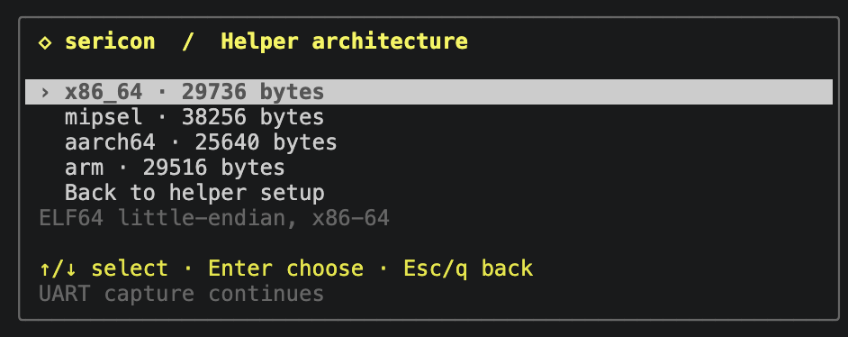
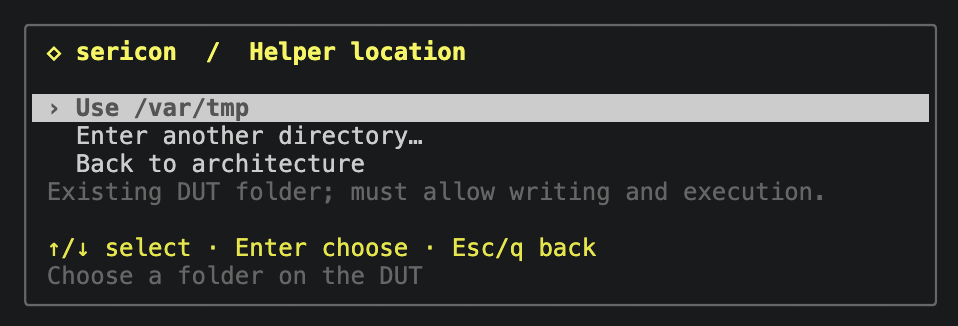
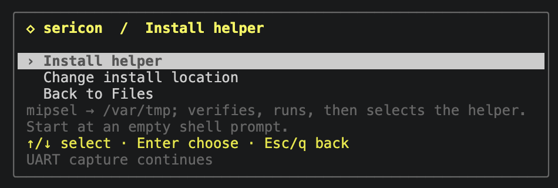

# Optional Linux helper

Sericon can upload a small, statically linked C executable when an embedded
Linux image lacks suitable transfer utilities. The host binary carries the
prepared payloads; neither host nor DUT needs Python, Bash, a package manager,
network access, a shared libc or an additional runtime to use them.

Protocol 2 provides identity/capability checks, directory listing, checksums,
bounded file reads, verified uploads and device inspection. It supports downloads,
uploads and overview collections through the host. It runs once per request in
the foreground and returns to the shell.
It does not change terminal settings or start a daemon. Rhai, menus, logging,
retry policy and AI access stay in the Rust host.

## Use

Start at an empty, logged-in Linux shell. Choose a payload matching the DUT's
architecture, byte order and ABI, and an existing writable directory on a
filesystem that permits execution. Architecture selection is explicit in this
beta; the shell CPU name alone does not establish byte order or ABI.

The helper is installed through the current session. No separate terminal is required.

1. Open **Ctrl-] m → Embedded Linux / Files → Set up helper → Install / upgrade helper**.
2. Choose the DUT architecture. The highlighted row shows the payload's ABI and size.
3. Choose **Use /var/tmp** or **Enter another directory…**. A custom path must be an existing DUT folder that permits writing and execution.
4. Review the selection, then choose **Install helper**. **Change install location** returns to the location menu.
5. Wait for verification and the capability check to complete. Files selects the helper on success; choose **Connect and browse** or **Inspect device**.

[](assets/screenshots/helper-architectures.png)

[](assets/screenshots/helper-location.png)

[](assets/screenshots/helper-review.png)

Arrows select, Enter chooses, and Esc/q goes back. Custom path entry uses an empty field; type the full path and press Enter to review. Failure or cancellation preserves the previous helper selection.

The picker reads the running broker's inventory, including ABI and size, rather
than assuming that a newly attached client has the same embedded payloads.
Older brokers need stopping and restarting with the updated binary to use this
picker. Opening it and configuring an install send nothing to the DUT. Once
running, Enter opens job options; **c** cancels and **Ctrl-] b** returns live
while the job continues. **r**
reopens the latest Files job; a completed install selects its verified path.

The CLI and formula routes remain available:

```sh
sericon files helpers
sericon files helper-install --arch mipsel --directory /var/tmp
sericon files read RUN_ID
```

The job returns immediately. Wait for `completed` and use the `helper` path in
its final result. The installation job also appears in Formulas and can be
started there as `linux-helper-install`, with parameters `arch` and `path`.

```sh
sericon files probe --helper /var/tmp/sericon-ID/helper
sericon files list /etc --helper /var/tmp/sericon-ID/helper
sericon files download /bin/busybox --helper /var/tmp/sericon-ID/helper --output-dir ./downloads
```

In **Files → Set up helper → Select existing helper** (shortcut **h**), select
that path. Sericon suggests the
last successful installation retained in this session. Press Enter to select
it, then Enter to connect and browse. Clear the helper path to return to the
existing shell-tools backend. Merely opening the menu never uploads or runs it.
The path selection is local to that Files view; install records last for the
broker's retained job history. After a session restart, enter the path again.

CLI, TUI, MCP and formulas share the same broker, writer, capture and background
jobs. `sericon_files_helper_install` takes `session`, `arch`, and `path` (the
existing DUT parent directory). The other Files MCP tools accept `helper`.
Restart older MCP bridges for the additional tool. Custom interactive formulas
can combine the operations:

```rhai
let installed = linux_helper_install("mipsel", "/var/tmp");
emit(installed);
emit(linux_download("/bin/busybox", "busybox.bin", installed.helper));
```

Supply an explicit host `output_dir` for downloads. Helpers release writer
ownership at completed shell boundaries; reclaim input before later manual
UART sends in a custom formula.

## Bootstrap and integrity

Bootstrap requires shell subshells/continuations, echo, cat, mkdir, chmod, rm,
and either a working `printf %b` or a byte-capable echo. BusyBox variants are
also tried. The installed helper replaces the missing dd/encoder/checksum and
listing utilities. On the TP-Link, bare echo interprets octal escapes and `\c`,
while `-n`/`-ne` are printed literally; capability probes handle this difference.

Before creating files, Sericon checks all 256 byte values and determines whether
UART output is unchanged or expands LF to CRLF. Other output transformations
are rejected. It creates a random private `sericon-ID` directory (0700), writes
256-byte parts using short physical command lines, and reads each back with
cat. Retries overwrite independently named parts rather than appending again.

The complete assembled executable is read back and compared byte-for-byte with
the bundled payload **before chmod or execution**. Console noise causes bounded
retries; it is never filtered out of arbitrary binary data. Three failed
attempts stop the job without executing an unverified image. A lost shell
completion marker retains ownership instead of assuming the write failed.
Ordinary exchanges allow ten seconds; complete-image readback and helper
whole-file checksums allow up to 120 seconds, still subject to the job deadline
and cancellation.

After verification, Sericon removes staging parts, sets executable mode 0700
and checks the protocol/capabilities. Execution can still fail on a noexec
filesystem, an incompatible ABI or an unsupported kernel. The helper has no
autostart configuration. Files remain until removed; reboot removes them only
on volatile storage. Failed jobs retain their private directory for inspection,
and report its path in results/progress. Remove only that recorded directory
when it is no longer needed. Temporary part files require more space than the
final executable (about 0.5 MiB of RAM-backed storage on the tested target).

The updated host accepts protocol-1 helpers for existing read operations.
Uploads and inspection require protocol 2: explicitly install a new helper,
using Files **a** (which selects it on success), or select its new path with **h**
after a CLI/formula install. Existing helpers are never overwritten automatically.
The updated broker must also be running; reattaching only updates the UI.
Files **u** uploads a new file, **i** inspects the DUT, and **s** collects the
overview. See [uploads and inspection](files.md#uploads-and-device-inspection)
for verification, publication, raw collection data and limits.

File operations retain the [Files limits](files.md): stable regular files up to
64 MiB, 512 entries per directory, no device/flash reads, symlink-file downloads
or pseudo-files. Every response uses a fresh request tag, hex encoding, a POSIX
CRC and byte count. Each download also matches complete-file checksums before
and after transfer; the host reports its own SHA-256. Corruption, timeout,
cancellation and human takeover preserve the existing ownership/partial-output
rules. These are integrity checks, not authentication of the target.

## Current coverage

The prepared payloads are **x86_64**, **mipsel**, **aarch64** and **arm**.
`files helpers` reports exact sizes, ABIs and SHA-256 from the running build.

| Payload | DUT ABI | Bytes | Validation |
| --- | --- | ---: | --- |
| x86_64 | ELF64 little-endian, x86-64 | 29,736 | Native shell/PTY fixtures |
| mipsel | ELF32 little-endian, o32, MIPS32r2, soft float | 38,256 | QEMU MIPS24Kc, without FPU |
| aarch64 | ELF64 little-endian, AArch64 LP64 | 25,640 | QEMU Cortex-A53 |
| arm | ELF32 little-endian, ARMv6KZ EABI hard-float, VFPv2 | 29,516 | QEMU ARM1176 |

All four are statically linked and have no ELF interpreter/shared-library
dependencies. The helper tests cover binary reads, directory listings, inspector
sections, verified/retried uploads, checksum failures, collisions and unsafe
paths on all four. ARM testing is CPU emulation, not physical DUT coverage.
The `arm` payload supports ARM1176 (original Pi/Zero) and compatible newer
32-bit Linux systems; it is not a soft-float, no-VFP or big-endian ARM build.
Choose `aarch64` for 64-bit Linux. MIPS has been
tested for protocol-1 installation/downloads on the physical TP-Link MT7628 /
MIPS24Kc with Linux 2.6.36. Protocol 2 is tested under QEMU 24Kc (no FPU);
x86-64 is covered with actual shell/PTY fixtures. This does not
establish compatibility with every old kernel or MIPS device.

The helper uses fixed small read/encoding buffers. libc directory handling and
process startup also consume memory; executable size is not a RAM measurement.
More DUT architectures, replacement uploads, a persistent multiplexed helper,
automatic ABI detection and shell-independent recovery remain later work.

## Building

The build-only script downloads pinned musl 1.2.5 from its upstream HTTPS
release, verifies its SHA-256, builds static libc and the helper, then records
compiler/flags/hashes in `target/helpers/`. It caches toolchains in `.local/`.
On a Linux x86-64 build host it requires Python 3.12+, make, binutils, native GCC,
`mipsel-linux-gnu-gcc`, `aarch64-linux-gnu-gcc`, and an ARMv6-compatible
`arm-buildroot-linux-musleabihf-gcc`. These compilers are build dependencies only.
No build artifacts are source. The default builds all four validated payloads.

For ARM32, the validated compiler is Bootlin's
[ARMv6 hard-float musl stable-2024.05-1 toolchain](https://toolchains.bootlin.com/releases_armv6-eabihf.html)
(GCC 13.3.0). Download it on the build host, check the
[published SHA-256](https://toolchains.bootlin.com/downloads/releases/toolchains/armv6-eabihf/tarballs/armv6-eabihf--musl--stable-2024.05-1.sha256),
extract it into `.local/toolchains/`, and add its `bin` directory to PATH:

```sh
mkdir -p .local/toolchains/downloads
curl --fail --location --output .local/toolchains/downloads/armv6-eabihf--musl--stable-2024.05-1.tar.xz \
  https://toolchains.bootlin.com/downloads/releases/toolchains/armv6-eabihf/tarballs/armv6-eabihf--musl--stable-2024.05-1.tar.xz
printf '%s\n' 'cc7444189685f9405636568a582395e4e2b95347f8be0e6d63ed4e2791ab9267  .local/toolchains/downloads/armv6-eabihf--musl--stable-2024.05-1.tar.xz' | sha256sum --check
# Continue only after the checksum passes.
tar -xf .local/toolchains/downloads/armv6-eabihf--musl--stable-2024.05-1.tar.xz -C .local/toolchains
export PATH="$PWD/.local/toolchains/armv6-eabihf--musl--stable-2024.05-1/bin:$PATH"
```

The script still builds its own pinned musl 1.2.5. The ARMv6 toolchain supplies
compatible compiler runtime/startup objects. A generic distribution
`arm-linux-gnueabihf-gcc` may bring in ARMv7 objects despite `-march=armv6`;
the build rejects a newer CPU/FPU requirement. Compiler/flag changes use a
separate libc cache, and failed payload rebuilds invalidate their Cargo stamp.

```sh
python3 helper/build.py
cargo build --release --locked
python3 tests/helper.py
python3 tests/integration.py
```

Repeat `--arch` to build a subset, for example
`python3 helper/build.py --arch aarch64 --arch arm`. The helper tests accept the
same selection, e.g. `python3 tests/helper.py --arch aarch64 --arch arm`.
The big-endian `mips` recipe remains unbuilt/unvalidated and is not bundled.
The MIPS GNU compiler runtime
can raise hard-float object-attribute warnings for its integer-only routines;
the resulting executable advertises soft float and passes the no-FPU CPU tests.

Cargo embeds all prepared payloads into every Sericon host build, including ARM
hosts. Source/build-recipe stamps reject stale payloads. If none are prepared,
Cargo warns and builds with no installable DUT payloads; ordinary serial and
shell-based Files operations still work. Never advertise a full helper release
without checking `sericon files helpers`. See [third-party notices](third-party.md)
or `sericon files helpers --licenses` (included in the host binary).
