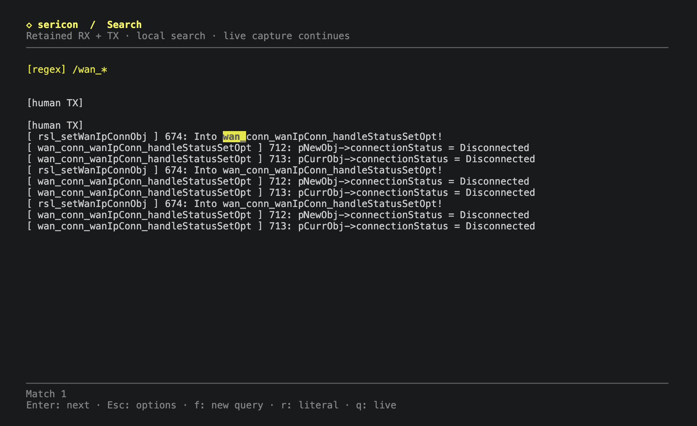

# Search session history

Search retained receive/transmit (RX/TX) history while UART capture continues. Open **Ctrl-] f**, type a query and press **Enter**. Enter advances through matches; **q** returns to live output.

## Controls

| Context | Key | Action |
| --- | --- | --- |
| Live terminal | **Ctrl-] f** | Open search |
| Query prompt | **Enter** | Submit the query |
| Query prompt | **Tab** | Switch literal/regex mode, preserving the query |
| Query prompt | **Backspace** / **Ctrl-U** | Edit / clear the query |
| Results or loading | **q** | Return to live output |
| Results | **Enter** | Next match; wrap after the last |
| Results or loading | **f** | Fresh query in the same mode |
| Results or loading | **r** / **Tab** | Switch mode and reopen the current query |
| Prompt or results | **Ctrl-] ?** | Show search help; Enter or q closes it |
| Prompt or results | **Ctrl-] b** | Return to live output |

Press **Ctrl-] then f**, type a word or phrase, and press **Enter**. Sericon
jumps to the first occurrence in retained history and highlights it with
surrounding context. Press **Enter** again for the next occurrence; after the
last one, search wraps to the first. While viewing results, **q** quits search
and returns to the live terminal; **f** opens a fresh search prompt, including
more recent output. These keys also work while a submitted search is loading
or when it finds no matches.

While typing a query, `q` and `f` are ordinary letters. **Ctrl-] then b** cancels
the prompt or returns from results, and **Ctrl-] then f** remains an alternative
way to open a new prompt. Quitting search leaves the UART session running.

Search defaults to case-sensitive literal text, including spaces, in received
and transmitted data. **Tab** in the prompt switches between **literal** and
**regex** mode while keeping your query. The mode is shown above the results.
From results, **r** switches mode and reopens the current query for editing;
press Enter to search again. A fresh query with **f** keeps the selected mode.

Regex examples:

| Pattern | Finds |
| --- | --- |
| `error\|warning` | Either word |
| `(?i)failed` | `failed` regardless of case |
| `timeout.*[0-9]+` | A timeout message followed by digits |
| `^ERROR\b` | Lines starting with the word `ERROR` |
| `code=\d{3}` | A code with three digits |

Regex matching uses the built-in [Rust regex syntax](https://docs.rs/regex/latest/regex/#syntax),
with no external command required. It searches one complete line at a time,
including lines split across UART reads; patterns do not span newlines.
Look-around and backreferences are unsupported. Invalid patterns leave the
prompt editable with an error message. Enter advances through nonoverlapping
regex matches; zero-width matches such as `^` appear as a highlighted `▏`.
For bounded memory use, regex search reports an error on lines over 8 MiB;
literal search remains available for those streams.

Both modes ignore terminal colour/control sequences and join
text split across serial reads. Backspace edits the prompt; Ctrl-U clears it.
Search strings can contain up to 1,024 UTF-8 bytes. No search keystrokes are
sent to the device. Stop (`Ctrl-] q`) and detach (`Ctrl-] d`) also work in search.

Each submitted search uses a snapshot of the retained history. UART capture,
logging, and other clients continue while you browse; returning to live displays
output received meanwhile. Searching preserves any unfinished input reservation.
Logged sessions search older journal history too, using a private temporary
snapshot that is removed when the search closes. With `--no-log`, search stays
in memory and reports when earlier history is unavailable. Long searches can
be cancelled immediately with `q` (or `Ctrl-] b`).
